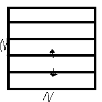
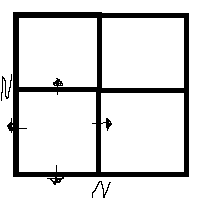

# Q2

## Assumptions

- 2D data set with $N_{grid}$ total grid points, $N$ on each side.
- $\chi$ FLOPs per iteration for each grid point.
- $P$ processors, that can perform $S$ FLOPs a second.
- A latency $L$ and bandwith $B$.
- $\Sigma$ grid points on boundaries between partitions.
- Only one comm operation per iteration
- No overlap between comms and computation
- Size of each message is $\sigma$ bytes per grid point.
- Periodic boundary conditions

## 1D Data Decomposition

For 1D decomposition, the grid is split into strips of size $\frac{N^2}{P}$. There are only 2 communications per iteration per strip, and each boundary has $N$ points.

Hence, $\Sigma = 2N$.

Figure of Merit, $F = \frac{P\Sigma}{N_{grid}} = \frac{P\Sigma}{N^2} = \frac{2P}{N}$ i.e. the fraction of grid points involved in comms is of order $P$.

The max number of processors before speed does not increase is given by $P_{max} = \frac{\chi N_{grid} B}{(\sigma \Sigma + N_{m} B L) S}$ for $N_{m}$ the number of messages.

For 1D, $P_{max} = \frac{\chi N^{2} B}{(2\sigma N+ N_{m} B L) S}$

## 2D Data Decomposition

For 2D decomposition, the grid is split into subgrids of size $\frac{N^2}{P}$. There are now 4 communications per iteration per subgrid, and each boundary has $\frac{N}{\sqrt{P}}$ points.

Hence, $\Sigma = 4\frac{N}{\sqrt{P}}$.

Figure of Merit, $F = \frac{P\Sigma}{N_{grid}} = \frac{P\Sigma}{N^2} = \frac{4\sqrt{P}}{N}$ i.e. the fraction of grid points involved in comms is of order $\sqrt{P}$.

$P_{max} = \frac{\chi N_{grid} B}{(\sigma \Sigma + N_{m} B L) S}$

For 2D, $P_{max} = \frac{\chi N^{2} B}{(4\sigma N \sqrt{P} + N_{m} B L) S}$

## Efficency

2D decomposition will become more efficent when it's figure of merit is lower than the 1D decomposition.

Hence:
$$\frac{4\sqrt{P}}{N} < \frac{2P}{N}$$
$$P > 4$$

Hence when there are more than 4 processors, the 2D decomposition is more efficent.