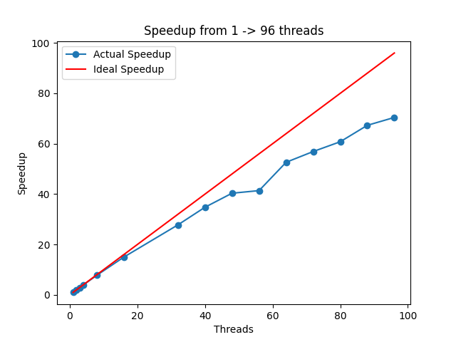
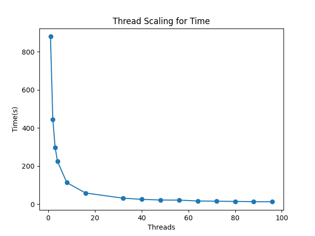

# Q3

## Part a

The profile output for the first run is:

```txt

  %   cumulative   self              self     total           
 time   seconds   seconds    calls  ms/call  ms/call  name    
 50.94    375.60   375.60 19121070     0.02     0.04  pbc_loop()
 45.18    708.74   333.13 14183404272     0.00     0.00  std::vector<double, std::allocator<double> >::operator[](unsigned long)
  3.71    736.11    27.38 19135071     0.00     0.00  std::vector<double, std::allocator<double> >::size() const
  0.15    737.25     1.14     4000     0.28   183.18  calculate_forces()
  0.01    737.36     0.11     4000     0.03     0.87  move_particles()
  
  Note function arguments have been omitted

  ```

In total it took around 739.39 seconds for the full run. The biggest bottleneck as identified by the profiler is the `pbc_loop()` below:

```c++

void pbc_loop(OMMITED_ARGUMENTS){

   const int num_particles = x.size();

   // define function variables
   double rjx, rjy, rjz, rjr; // particle j positions/radii
   double dx, dy, dz, rr; // position vector and radii

   for (int j = 0; j < num_particles; j++){
      rjx = x[j] + offset_x;
      rjy = y[j] + offset_y;
      rjz = z[j] + offset_z;
      rjr = particle_radius[j];
      dx = rjx-rix;
      dy = rjy-riy;
      dz = rjz-riz;
      rr = (rir+rjr)*(rir+rjr);
      // check if particles overlap
      if(dx*dx+dy*dy+dz*dz < rr){
         fx += -force_size*dx;
         fy += -force_size*dy;
         fz += -force_size*dz;
      }
   }
}
```

The program spends a lot of time in this function as it is called many times in other functions (mostly `calculate_forces()`), and is not very optimised. This function performs an overlap check between particle $i$ (which calls the function) and every other particle in the system (particle $j$). This is then a O(N^2) loop, which is very slow for large number of particles, such as in this case when there are 4000 particles. This could be optimised with a nearest neighbour approach, where only the nearest neighbour particles of i are checked for overlap. However this is not a good candidate for making parallel as it is called many times in `calculate_forces()`, and continually setting up and taking down the threads will incur quite a large overhead. Thus naturally, it is better to make `calculate_forces()` parallel. This will cause great speedup.

```c++
void calculate_forces()
{
   /* Code */

   for (int i = 0; i < np; i++)
      {
         riz = z[i];
         rix = x[i];
         riy = y[i];
         rir = particle_radius[i];
         fx = 0.0;
         fy = 0.0;
         fz = 0.0;

         /* MAIN CODE */

         force_x[i] = fx;
         force_y[i] = fy;
         force_z[i] = fz;

      } // i-loop
}
```

This function has the most work, thus is the natural candidate for making parallel. OpenMP utilises `omp for` which is used on `for` loops. This work also might be a good candidate for `omp task`, which handles the load bearing of the work across threads better than `omp for`.

The next bottleneck is reading from vectors, as given by the second line in the profile. Work could be done to reduce the number of look ups of vectors, however this is more of a serial optimisation.

## Part b

I did two trials of different OpenMP directives for speedup, one for `omp for` and one for `omp task`. The results for this are in the `second_run` and `third_run` directory respectively.

### First Trial

```c++

void calculate_forces(OMITTED ARGUMENTS)
{

   const int np = x.size();
   const double force_size = 0.1;

   // define function variables
   double rix, riy, riz, rir;         // particle j positions/radii
   double fx, fy, fz;                 // force components
   bool bpx, bmx, bpy, bmy, bpz, bmz; // boolean tests

// loop over all particles and calculate total force
#pragma omp parallel for default(shared) private(rix, riy, riz, rir, fx, fy, fz,
bpx, bmx, bpy, bmy, bpz, bmz)
   for (int i = 0; i < np; i++)
   {
      /* MAIN CODE */

      force_x[i] = fx;
      force_y[i] = fy;
      force_z[i] = fz;
   }
}

```

This was the major change of the code. As everything that involved shared data (i.e. `force_*`) in the loop was read-only, there were no race conditions to update the vectors as each `i` is private to the thread, and each thread will have a different `i` concurrently. 

```c++

void move_particles(OMITTED ARGUMENTS)
{

   const double mass = 1.0;
   const int np = x.size();

// relaxation algorithm - simply move particles along direction of force
#pragma omp parallel for default(shared)
   for (int i = 0; i < np; i++)
   {
      x[i] = x[i] + fx[i] * dt;
      y[i] = y[i] + fy[i] * dt;
      z[i] = z[i] + fz[i] * dt;
   }

}

void shrink(OMITTED ARGUMENTS)
{

   const double shrink_factor = (L - dL) / L;
   const int np = x.size();

// relaxation algorithm - simply move particles along direction of force
#pragma omp parallel for default(shared)
   for (int i = 0; i < np; i++)
   {
      x[i] = x[i] * shrink_factor;
      y[i] = y[i] * shrink_factor;
      z[i] = z[i] * shrink_factor;
   }
}

```
Similarly here in the `move_particles()` and `shrink()` functions, I used an `omp for` directive. Once again, all the shared data is accessed with a private variable `i` thus there are no race conditions to be concerned about. 

Using `Linux` command `diff` on the output for this run against the `first_run` results, there were no differences. This follows with the fact that there were no race conditions. 

The time for this trial was `12.5` seconds, as seen in `second_run/times.txt`. This was ran on `GViking` with 96 threads.

### Second trial

```c++
void calculate_forces(OMITTED ARGUMENTS)
{
   #pragma omp single
         {
            for (int i = 0; i < np; i++)
            {
   #pragma omp task firstprivate(i) shared(force_x, force_y, force_z)
               {
                  double riz = z[i];
                  double rix = x[i];
                  double riy = y[i];
                  double rir = particle_radius[i];
                  double fx = 0.0;
                  double fy = 0.0;
                  double fz = 0.0;

                  /* MORE CODE */

                  force_x[i] = fx;
                  force_y[i] = fy;
                  force_z[i] = fz;
               }
            }
         }
}

```

This time I ran the code with creating all work done in the loops as `omp tasks`. I did this in an identical way for `calculate_forces()`, `move_particles()` and `shrink()`. 

`omp tasks` are better designed for load bearing, where a `single` thread creates the `task` where the major work is done. The specified `firstprivate(i)` ensures that each task has its own `i` value, so no race conditions occur. Now threads pick up `tasks` from the master thread, which ensures that no threads are idle while completing the loop. However, this incurs a slightly larger overhead than `omp for` so is useful for when the work each thread has to do is differently loaded to each other. For our case however, every task does the same amount of work due to the discussed `O(N^2)` loop. So it is likely that this will be slightly slower than `omp for`.

Using `Linux` command `diff` on the output for this run against the `second_run` results, there were no differences. This follows with the fact that there were no race conditions. 

The time for this trial was `13.04` seconds, as seen in `third_run/times.txt`. This was ran on `GViking` with 96 threads.

And as expected, the `omp task` approach is slightly slower. It is likely the case that this would be a lot slower at lower threads due to the overhead of tasks compared to `omp for`.

Thus I used the first trial code, which is what is seen in `packing/packing_parallel.cpp`

## Part c

Running on `GViking` with scripts in `run_scripts` and `job_scripts`, I ran a scaling test on the modified code from 1 -> 96 threads. The table below shows the actual time taken and the speedup for each thread run compared to 1 thread. These results can be found in the `data` directory.

| Number of Threads 	| Time(s) 	| Speedup    	|
|-------------------	|---------	|------------	|
| 1                 	| 879.028 	| 1          	|
| 2                 	| 444.113 	| 1.97928905 	|
| 3                 	| 298.072 	| 2.94904587 	|
| 4                 	| 224.447 	| 3.91641679 	|
| 8                 	| 113.102 	| 7.77199342 	|
| 16                	| 58.5899 	| 15.0030637 	|
| 32                	| 31.6238 	| 27.7964065 	|
| 40                	| 25.2662 	| 34.790669  	|
| 48                	| 21.7798 	| 40.3597829 	|
| 56                	| 21.2322 	| 41.4007027 	|
| 64                	| 16.6987 	| 52.6405049 	|
| 72                	| 15.4474 	| 56.9045924 	|
| 80                	| 14.4606 	| 60.7877958 	|
| 88                	| 13.0613 	| 67.3001922 	|
| 96                	| 12.4804 	| 70.4326784 	|





The first graph plots the speedup the code achieved against the possible speedup. This is the theoretical limit of parallel programming, where increasing the number of threads causes the code to speed up that many times, i.e. a linear relation. At quite low threads, it is shown that we are achieving this theoretical speedup. However as the threads increase, there is more of a divergence from the line. This is due to the effects of Amdahl's Law $T(N) = S + \frac{P}{N}$ for $S$ serial execution and $P$ parallel execution. This law shows that at higher and higher threads, the serial execution time will dominate, causing a divergence from the ideal. 

Another reason is the communication between threads and memory when accessing or writing to shared data. As more threads are used, there needs to be more communication between memory and the thread, and due to finite bandwidth, the latency will likely dominate the communication time, causing a larger slow down at higher thread numbers.

The second graph shows an exponential decrease in the time taken as the thread numbers increase. This is expected with parallel programming. 


