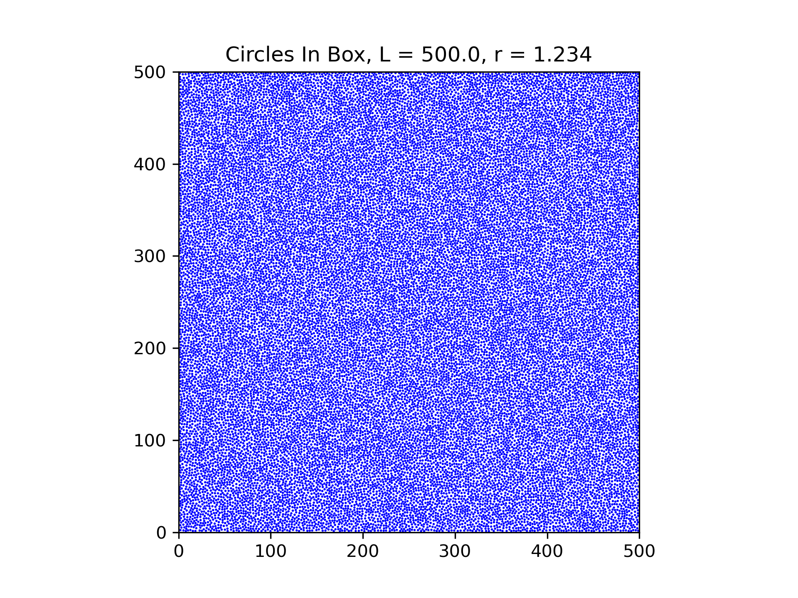
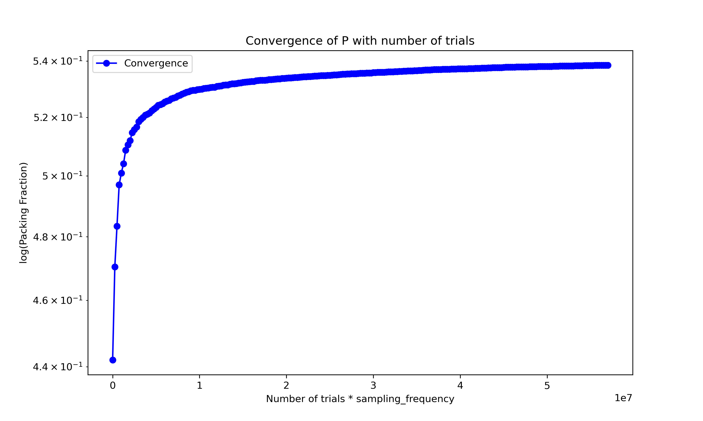

# Q4

## Part a

### General Overview

The logic for the serial code (found in `src/src_serial`) is as follows

- Load in the config file (`config/config.txt`) from the user
- Initalise all variables necessary
- Start a `while (true)` loop
- Within the loop, circle centers are generated via a seeded random number generator. Those circles are checked against an `unordered_map` of the other generated circles for overlap. 
- If no overlap is found, it is placed within the `unordered_map`
- After the user parameter `sampling_frequency` number of trials, there is a check for convergence. If the number of circles generated has not changed after `sampling_frequency` trials, then there can be no more circles placed without overlap with these parameters and the loop is exited.
- The final resutls are outputted and graphs can be plotted (`graphing/graph.py`).

The use of `make` with the rules `serial`, `serial_debug`, `serial_vis` are used to compile the source code. Each rule gives a different binary output with:

- `serial`: Runs the binary without any visualisation or debugging, and outputs final answer.
- `serial_debug`: Runs the binary with custom debugging flags.
- `serial_vis`: Runs the binary with custom visulisation flags, that continually outputs the key data for visulation purposes (you can watch the numbers go up).

I highly recommend using the bash script `run_serial.sh` with command `bash ./run_serial <MAKE_RULE>`. This builds and executes the binary, and will create directories for results to be moved into, which then can be plotted using the Python script.

### Specfics

#### Generation of circles

```c++
/* Generates and returns a Point, within the boundaries */
Point gen_random_pair(rng &random_gen)
{
    return {
        r + (L - 2 * r) * random_gen.grnd(),
        r + (L - 2 * r) * random_gen.grnd(),
    };
}
```

The generating function will generate a random number taht has been rpeviously seeded, with a number that is within the boundaries of the box. This assures that no circle can overlap the boundary, and reduces the need to run four comparison checks every generation.

#### Checking overlap

The biggest bottleneck to this problem is the checking the overlap of circles. A naive approach would be a simple comparison between every circle, giving an `O(N^2)` loop. For efficency, I implemented a hash map that relates `Cells` to `vector<Point>` i.e I split the grid up into cells that are determined by the input parameters `L` and `r` i.e. `grid_size = static_cast<int>(L / (2 * r));`. 

```c++

// Check if a new circle overlaps with circles in nearby grid cells
bool check_overlap(const Point &new_circle)
{
    Cell cell = get_grid_cell(new_circle);

    const vector<Cell> neighbours = {{-1, -1}, {-1, 0}, {-1, 1}, 
    {0, -1}, {0, 0}, {0, 1}, {1, -1}, {1, 0}, {1, 1}};

    // Check nearby neighbour cells

    for (auto &neighbour : neighbours)
    {
        Cell neighbor_cell = {cell.first + neighbour.first, 
        cell.second + neighbour.second};

        // Check if neighbor cell exists in the spatial grid
        if (grid.find(neighbor_cell) != grid.end())
        {
            for (const auto &existing_circle : grid[neighbor_cell])
            {
                // Compute squared distance for comparison
                double dx = existing_circle.first - new_circle.first;
                double dy = existing_circle.second - new_circle.second;
                double distance_squared = dx * dx + dy * dy;

                if (distance_squared < r_comp)
                {
                    return true; // If overlap, return true
                }
            }
        }
    }

    return false; // No overlap found
}

```

The `check_overlap` function will only compare the circles that are within the nearest neighbour cells. This is a lot more efficent than `O(N^2)`, as a hash map (with a good hash) is on average `O(1)` lookup time. 

#### Sampling Frequency approach

I implemented a `sampling_frequency` approach to the generation of circles, to fit into the idea of "run until no more circles can be placed". Choosing a small `sampling_frequency` will be more efficent, however is very likely to miss a lot of circles that could be generated. On the other hand, choosing a large `sampling_frequency` will be less efficent, but you will ikely catch a lot of circles that could be generated. An improvement that could be made is to make the parameter dynamic. I found that a parameter of `1e6` is a good benchmarch, however results have been given for `1e6`, `1.25e6`, `1.50e6`, and `1e7`. These can also be found in `results/serial_results/L=500, r=1.234/sf={SAMPLING_FREQUENCY}`. All these results were run on `VIKING` with `job_serial.sh`.

### Results

#### Table

| Sampling Frequency 	| Number of Circles Placed 	| Packing Fraction 	| Time(s)    	|
|--------------------	|--------------------------	|------------------	|------------	|
| 1e6                	| 28141                    	| 0.538493         	| 176.691515 	|
| 1.25e6             	| 28199                    	| 0.539602         	| 253.402379 	|
| 1.50e6             	| 28226                    	| 0.540119         	| 290.254791 	|
| 1e7                	| 28335                    	| 0.542205         	| 841.623180 	|

#### Plots






The above plots are for `sampling frequency=1e6`. The plots across all sampling frequencies are very similar, and more can be found in `./results/serial_results`. Note for the convergence plot, at every `sampling_frequency / 4` intervals and after each generation of trials, a point is plotted. This is why the x-axis is lablled `Number of trials * sampling_frequency`.

## Part b

### General Overview

The logic for the parallel code (found in `src/src_parallel`) is as follows:

The logic for the serial code (found in `src/src_serial`) is as follows

- Load in the config file (`config/config.txt`) from the user
- Initalise all variables necessary
- Initalise an OpenMP parallel region
- Initalise a thread-local random number generator with a unique seed depending on the thread id and total number of threads.
- Start a `while` loop
- Within the loop, circle centers are generated in parallel, and added to a new vector `trial_placements` with size `sampling_frequency`. Each circle has a flag associated with it. 
- Trials are checked in parallel with the grid of placed circles for overlap. If an overlap is found, the trial's flag is set.
- Trials are checked in parallel within themselves, skipping any trials that have flags that are already set.
- Trials that have not got a set flag are placed in the grid.
- There is a check for convergence. If the number of circles generated has not changed after `sampling_frequency` trials, then there can be no more circles placed without overlap with these parameters and the loop is exited.

The use of `make` with the rules `parallel`, `parallel_debug`, `parallel_vis` are used to compile the source code. Each rule gives a different binary output with:

- `parallel`: Runs the binary without any visualisation or debugging, and outputs final answer.
- `paralle_debug`: Runs the binary with custom debugging flags.
- `parallel_vis`: Runs the binary with custom visulisation flags, that continually outputs the key data for visulation purposes (you can watch the numbers go up).

I highly recommend using the bash script `run_parallel.sh` with command `bash ./run_parallel <MAKE_RULE> <NUM_OF_THREADS>`. This builds and executes the binary, and will create directories for results to be moved into, which then can be plotted using the Python script (note: The packing fraction convergence is not plotted here).

### Why OpenMP

I chose to use OpenMP due to the clear cut logic that is required. Generating random points is a task that can easily be done in parallel, same with read only checking. OpenMP provides easy to use synchornisation in the form of barriers and critical statments, so updating shared resources like the grid is already controlled. OpenMP excels for dynamic workloads, utilising all threads effectively. 

I did not want to use MPI for splitting up the grid, as for example, if spilt the grid into chunks and had each chunk generate circles, there will likely be correlation across the boundaries of the chunks, leading to space between the boundaries that other circles could be placed.  

