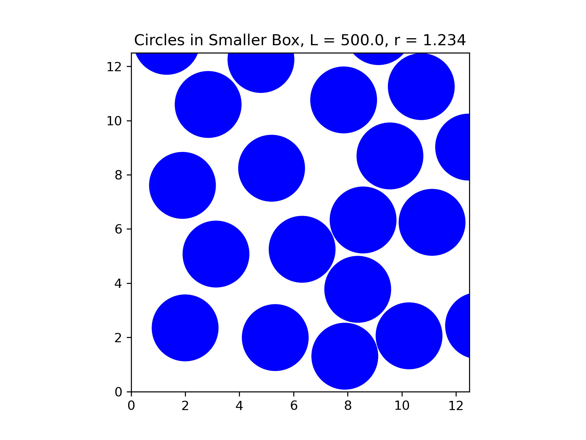
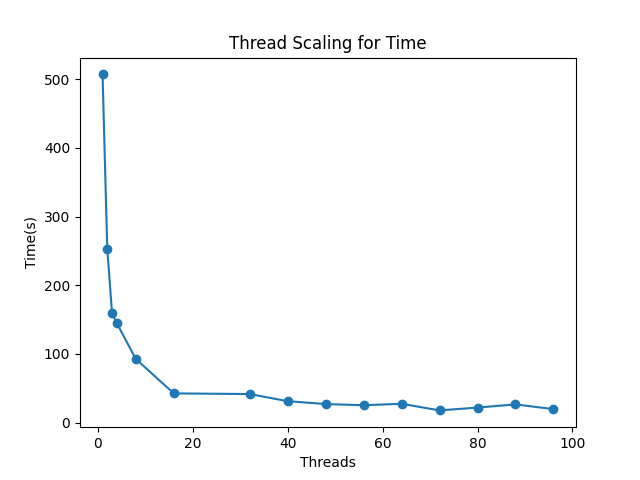
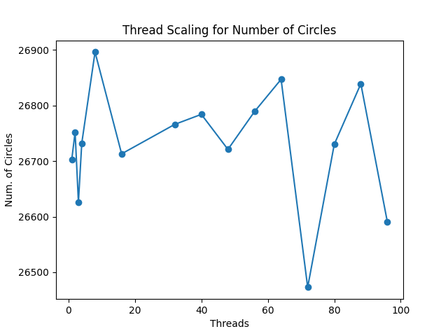
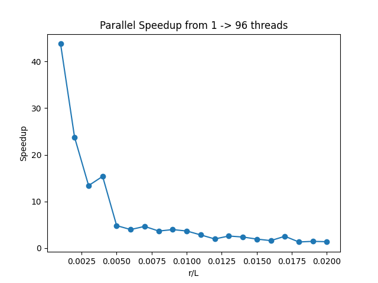
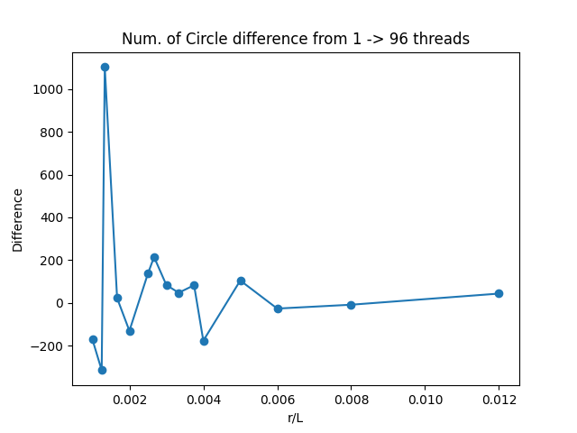

# Q4

## Part a

### General Overview

The logic for the serial code (found in `src/src_serial`) is as follows

- Load in the config file (`config/config.txt`) from the user
- Initalise all variables necessary
- Start a `while (true)` loop
- Within the loop, circle centers are generated via a seeded random number generator. Those circles are checked against an `unordered_map` of the other generated circles for overlap. 
- If no overlap is found, it is placed within the `unordered_map`
- After the user parameter `sampling_frequency` number of trials, there is a check for convergence. If the number of circles generated has not changed after `sampling_frequency` trials, then there can be no more circles placed without overlap with these parameters and the loop is exited.
- The final resutls are outputted and graphs can be plotted (`graphing/graph.py`).

The use of `make` with the rules `serial`, `serial_debug`, `serial_vis` are used to compile the source code. Each rule gives a different binary output with:

- `serial`: Compiles the code without any visualisation or debugging, and outputs final answer.
- `serial_debug`: Compiles the code with custom debugging flags.
- `serial_vis`: Compiles the code with custom visulisation flags, that continually outputs the key data for visulation purposes (you can watch the numbers go up).

I highly recommend using the bash script `run_serial.sh` with command `bash ./run_serial.sh <MAKE_RULE>`. This builds and executes the binary, and will create directories for results to be moved into, which then can be plotted using the Python script.

The program requires a config file at the path `./config/config.txt`. An example one is below:

```txt

r 1.234
L 500
sampling_frequency 1000000
seed 18293
```

### Specfics

#### Generation of circles

```c++
/* Generates and returns a Point, within the boundaries */
Point gen_random_pair(rng &random_gen)
{
    return {
        r + (L - 2 * r) * random_gen.grnd(),
        r + (L - 2 * r) * random_gen.grnd(),
    };
}
```

The generating function will generate a random number (that has been previously seeded) with a number that is within the boundaries of the box. This assures that no circle can overlap the boundary, and reduces the need to run four comparison checks every generation.

#### Checking overlap

The biggest bottleneck to this problem is the checking the overlap of circles. A naive approach would be a simple comparison between every circle, giving an `O(N^2)` loop. For efficency, I implemented a hash map that relates `Cells` to `vector<Point>` i.e I split the grid up into cells that are determined by the input parameters `L` and `r` i.e. `grid_size = static_cast<int>(L / (2 * r));`. 

```c++

// Check if a new circle overlaps with circles in nearby grid cells
bool check_overlap(const Point &new_circle)
{
    Cell cell = get_grid_cell(new_circle);

    const vector<Cell> neighbours = {{-1, -1}, {-1, 0}, {-1, 1}, 
    {0, -1}, {0, 0}, {0, 1}, {1, -1}, {1, 0}, {1, 1}};

    // Check nearby neighbour cells

    for (auto &neighbour : neighbours)
    {
        Cell neighbor_cell = {cell.first + neighbour.first, 
        cell.second + neighbour.second};

        // Check if neighbor cell exists in the spatial grid
        if (grid.find(neighbor_cell) != grid.end())
        {
            for (const auto &existing_circle : grid[neighbor_cell])
            {
                // Compute squared distance for comparison
                double dx = existing_circle.first - new_circle.first;
                double dy = existing_circle.second - new_circle.second;
                double distance_squared = dx * dx + dy * dy;

                if (distance_squared < r_comp)
                {
                    return true; // If overlap, return true
                }
            }
        }
    }

    return false; // No overlap found
}

```

The `check_overlap` function will only compare the circles that are within the nearest neighbour cells. This is a lot more efficent than `O(N^2)`, as a hash map (with a good hash) is on average `O(1)` lookup time. 

#### Sampling Frequency approach

I implemented a `sampling_frequency` approach to the generation of circles, to fit into the idea of "run until no more circles can be placed". Choosing a small `sampling_frequency` will be more efficent, however is very likely to miss a lot of circles that could be generated. On the other hand, choosing a large `sampling_frequency` will be less efficent, but you will ikely catch a lot of circles that could be generated. An improvement that could be made is to make the parameter dynamic. I found that a parameter of `1e6` is a good benchmarch, however results have been given for `1e6`, `1.25e6`, `1.50e6`, and `1e7`. These can also be found in `results/serial_results/L=500, r=1.234/sf={SAMPLING_FREQUENCY}`. All these results were run on `VIKING` with `job_serial.sh`.

### Results

#### Table

| Sampling Frequency 	| Number of Circles Placed 	| Packing Fraction 	| Time(s)    	|
|--------------------	|--------------------------	|------------------	|------------	|
| 1e6                	| 28141                    	| 0.538493         	| 176.691515 	|
| 1.25e6             	| 28199                    	| 0.539602         	| 253.402379 	|
| 1.50e6             	| 28226                    	| 0.540119         	| 290.254791 	|
| 1e7                	| 28335                    	| 0.542205         	| 841.623180 	|

#### Plots





The above plots are for `sampling frequency=1e6`. The plots across all sampling frequencies are very similar, and more can be found in `./results/serial_results`. Note for the convergence plot, at every `sampling_frequency / 4` intervals and after each generation of trials, a point is plotted. This is why the x-axis is lablled `Number of trials * sampling_frequency`.

## Part b

### General Overview

The logic for the parallel code (found in `src/src_parallel`) is as follows:

- Load in the config file from the user
- Initalise all variables necessary
- Initalise an OpenMP parallel region
- Initalise a thread-local random number generator with a unique seed depending on the thread id and total number of threads.
- Start a `while` loop
- Within the loop, circle centers are generated in parallel, and added to a new vector `trial_placements` with size `sampling_frequency`. Each circle has a flag associated with it. 
- Trials are checked in parallel with the `unordered_map` of placed circles for overlap. If an overlap is found, the trial's flag is set.
- Trials are checked in parallel within themselves, skipping any trials that have flags that are already set.
- Trials that have not got a set flag are placed in the map.
- There is a check for convergence. If the number of circles generated has not changed after `sampling_frequency` trials, then there can be no more circles placed without overlap with these parameters and the master thread calls for all other threads to continue through their loops.

The use of `make` with the rules `parallel`, `parallel_debug`, `parallel_vis` and `parallel_vik` are used to compile the source code. Each rule gives a different binary output with:

- `parallel`: Compiles the code without any visualisation or debugging, and outputs final answer.
- `paralle_debug`: Compiles the code with custom debugging flags.
- `parallel_vis`: Compiles the code with custom visulisation flags, that continually outputs the key data for visulation purposes (you can watch the numbers go up).
- `parallel_vik`: Compiles the code with flags custom flag for running on VIKING.

I highly recommend using the bash script `run_parallel.sh` with command `bash ./run_parallel.sh <MAKE_RULE> <NUM_OF_THREADS>`. This builds and executes the binary, and will create directories for results to be moved into (note: The packing fraction convergence is not calculated here).

The parallel code also accepts a command line argument `--config=PATH_TO_CONFIG`, however will default to the config path `./config/config.txt`. Note `run_parallel.sh` can only accept the default config path. I added the flag for ease of use when doing the ratio scaling tests.

It is important to recognise that the values here for the number of circles are unlikely to match the serial version with the same parameters, due to the fact each thread has a local random number generator, so there are different sequences of numbers being trialed.


### Specfics

#### Why OpenMP

I chose to use OpenMP due to the clear cut logic that is required. Generating random points is a task that can easily be done in parallel, same with read only checking. OpenMP provides easy to use synchornisation in the form of barriers and critical statments, so updating shared resources like the grid is already controlled, and doesn't require special communication like from MPI. OpenMP excels for dynamic workloads, utilising all threads effectively which is needed when checking overlaps. 

I did not want to use MPI for splitting up the grid, as for example, if spilt the grid into chunks and had each chunk generate circles, there will likely be an equal distribution across the boundaries of the chunks.  

#### Generation of circles
```c++

        rng local_random_gen;
        int tid = omp_get_thread_num();
        // Unique seed per thread
        local_random_gen.seed(tid * seed + omp_get_num_threads()); 

        while (!done)
        {
            // Parallel loop to generate trials
            #pragma omp for schedule(static)
            for (int i = 0; i < sampling_frequency; i++)
            {
                if (done)
                    continue; // Check shared flag to stop early
                // Generate new trial circle
                Point new_circle = gen_random_pair(local_random_gen); 
                // Store it globally
                trial_placements[i] = {new_circle, false};            
            }

        /* Sync all threads, ensuring that trials are
        generated before checking overlaps */
        #pragma omp barrier

        // More code
```

The generation of circles is now in parallel, where each thread has a differently seeded random number generator. Due to this, changing the number of threads will change the number of circles that are eventually placed, as with each new thread used there are more sequences of numbers that are being trialed. This could have been avoided with only using a single thread to generate numbers, however in that case, all other threads are not being used effectivly for smaller grids. Each trial has a flag that starts as `false`, which will be set if any overlap is found.

By specifying the scheduling of the loop to `static` this guarntees consistency across runs with the same number of threads, however does add a slight overhead as now some threads will be idle.

#### Checking overlap

With the introduction of generating circles in parallel, there is a need for another check that the generated circles themselves do not overlap. This was not a problem in the serial code as there was only one circle generated at a time. 

```c++

// **Overlap Check Between Trials and Grid**
#pragma omp for schedule(dynamic)
            for (int i = 0; i < sampling_frequency; i++)
            {
                if (done)
                    continue; // Check shared flag to stop work early

                check_overlap(trial_placements[i]);
            }

// Sync all threads after overlap check
#pragma omp barrier

// **Overlap Check Between Trials Internally**
// All trials generated by all threads must be compared with each other.
#pragma omp for schedule(static)
            for (int i = 0; i < sampling_frequency; i++)
            {
                if (done)
                    continue; // Check shared flag to stop early

                if (trial_placements[i].second)
                    continue; // Skip raised flag already

                // Compare each trial with others
                for (int j = i + 1; j < sampling_frequency; j++) 
                {
                    // Compare trial[i] with trial[j] for overlap
                    Point circle1 = trial_placements[i].first;
                    Point circle2 = trial_placements[j].first;

                    double dx = circle2.first - circle1.first;
                    double dy = circle2.second - circle1.second;
                    double distance_squared = dx * dx + dy * dy;

                    if (distance_squared < r_comp)
                    {
                        // Set overlap flag for one trial if they 
                        // overlap, the other is still possible trial
                        trial_placements[i].second = true;
                        break;
                    }
                }
            }

#pragma omp barrier

// More code
```

The `check_overlap()` function is effectivly the same as before, but now threads call it in parallel to check. This only reads the grid, so is safe to do in parallel. This also means the scheduling can be `dynamic`, which improves the load bearing. If there is an overlap found, the flag on the circle is set. As each thread will have it's own unique trial placement to set the flag on, this is also thread safe.

After a synchronisation, there is an internal check between trials, in the form of `O(N^2)` loop. To avoid the cost of this however, we skip any set flags. Each thread has it's own unique sequences to check within the trials. The implementation of similar grid logic as the serial version was tried here, however it was very difficult to make it thread safe and caused more slow down, as all the trials needed to be placed in another grid first. The `O(N^2)` loop does gurantee that no circles can overlap. However the schedule for this also has to be `static` to gurantee consistency. This occurs more of an slow down as now some threads may have larger loads, however is necessary for consistency.

#### Placing the circles

```c++

            // Place the trials in the grid based on their flag
            #pragma omp for schedule(dynamic)
            for (int i = 0; i < sampling_frequency; i++)
            {
                if (done)
                    continue;

                if (!trial_placements[i].second) // No overlap
                {

                    // Enter critical section to update shared resources
                    #pragma omp critical
                    {
                        Point new_circle = trial_placements[i].first;
                        circle_coords.push_back(new_circle); // Add to circle coordinates
                        place_circle(new_circle);            // Place circle in the grid
                    }
                }
            }

// More code
```

This is the only critical section of the code due to adding to the grid. 


### Scaling Tests

#### Thread Scaling

I ran the thread scaling test on `VIKING` with user parameters:
```txt

L = 500
r = 1.234
sampling_frequency = 1000000 = 1e6
seed = 18293
```

using `job_parallel.sh` and `run_parallel_viking.sh`. These scripts control the changing of the number of threads, creating the directories for results and using `make` to `make parallel` or `make parallel_vik` (depending on use). All relevant flags can be found in the Makefile. I decided to run on multiples of 8 threads, after the inital 4.

| Number of   Threads  	| Time(s)  	|
|----------------------	|----------	|
| 1                    	| 507.1868 	|
| 2                    	| 252.4379 	|
| 3                    	| 159.5824 	|
| 4                    	| 144.9173 	|
| 8                    	| 92.74313 	|
| 16                   	| 42.5562  	|
| 32                   	| 41.62602 	|
| 40                   	| 31.21906 	|
| 48                   	| 27.05239 	|
| 56                   	| 25.28407 	|
| 64                   	| 27.44813 	|
| 72                   	| 17.79633 	|
| 80                   	| 21.92479 	|
| 88                   	| 26.5281  	|
| 96                   	| 19.65813 	|



The graph above shows the mean times for the run. The graph shows that the speedup is roughly exponential, which is expected for parallelism. The speed up from 1 thread to 96 threads is ~25.8x for these parameters.

| Number of   Threads  	| Number of Circles 	|
|----------------------	|-------------------	|
| 1                    	| 26703             	|
| 2                    	| 26752             	|
| 3                    	| 26626             	|
| 4                    	| 26732             	|
| 8                    	| 26896             	|
| 16                   	| 26713             	|
| 32                   	| 26766             	|
| 40                   	| 26784             	|
| 48                   	| 26721             	|
| 56                   	| 26789             	|
| 64                   	| 26847             	|
| 72                   	| 26473             	|
| 80                   	| 26730             	|
| 88                   	| 26839             	|
| 96                   	| 26590             	|



The graph shows the number of circles for the run. Due to the nature of the problem (as described previously), there are differences as the number of threads increases. 

#### r / L ratios

I ran the thread scaling test on `VIKING` with user parameters:
```txt
r=VARIABLE
L=1000
sampling_frequency = 100000 = 1e5
seed=18293
```

using a large amount of job scripts (see `previous_job_scripts`). These scripts control the changing of the number of threads, creating the directories for results and using `make` to `make parallel` or `make parallel_vik` (depending on use). All relevant flags can be found in the Makefile. I decided to iterate through r from 1 to 20 while keeping L=1000. 

| r  	| Time (1 thread) (s) 	| Time (96 threads) (s) 	| Speedup (1 -> 96 threads) 	|
|----	|---------------------	|-----------------------	|---------------------------	|
| 1  	| 615.297813          	| 14.054726             	| 43.78                     	|
| 2  	| 103.979342          	| 4.377201              	| 23.75                     	|
| 3  	| 25.407766           	| 1.893825              	| 13.42                     	|
| 4  	| 16.755429           	| 1.088905              	| 15.39                     	|
| 5  	| 4.915592            	| 1.015496              	| 4.84                      	|
| 6  	| 3.813935            	| 0.954506              	| 4.00                      	|
| 7  	| 3.2491              	| 0.695557              	| 4.67                      	|
| 8  	| 2.208212            	| 0.600623              	| 3.68                      	|
| 9  	| 1.859043            	| 0.466592              	| 3.98                      	|
| 10 	| 1.296213            	| 0.351444              	| 3.69                      	|
| 11 	| 1.271669            	| 0.44734               	| 2.84                      	|
| 12 	| 0.55206             	| 0.278407              	| 1.98                      	|
| 13 	| 0.967813            	| 0.37125               	| 2.61                      	|
| 14 	| 0.840325            	| 0.350636              	| 2.40                      	|
| 15 	| 0.56483             	| 0.289351              	| 1.95                      	|
| 16 	| 0.621947            	| 0.382765              	| 1.62                      	|
| 17 	| 0.481745            	| 0.188487              	| 2.56                      	|
| 18 	| 0.387136            	| 0.289924              	| 1.34                      	|
| 19 	| 0.339204            	| 0.231364              	| 1.47                      	|
| 20 	| 0.321071            	| 0.23071               	| 1.39                      	|



The graph above shows the parallel speedup for the different ratios. As expected, the original parameters `L=500, r=1.234` was not a big enough problem for the parallel code to get the best speedup. At the smallest ratio (`L=1000, r=1`), there is a ~43x speedup. This indicates that these parameters could fully utilise the parallel threading. However as the ratio increases, the effective speedup becomes quite small.

| r  	| Num of Circles(1 thread) 	| Num of Circles (96 threads) 	| Difference (96 threads - 1 thread) 	|
|----	|--------------------------	|-----------------------------	|------------------------------------	|
| 1  	| 166986                   	| 166526                      	| -460.00                            	|
| 2  	| 41159                    	| 40961                       	| -198.00                            	|
| 3  	| 17869                    	| 17769                       	| -100.00                            	|
| 4  	| 9971                     	| 9826                        	| -145.00                            	|
| 5  	| 6223                     	| 6300                        	| 77.00                              	|
| 6  	| 4301                     	| 4315                        	| 14.00                              	|
| 7  	| 3164                     	| 3146                        	| -18.00                             	|
| 8  	| 2393                     	| 2396                        	| 3.00                               	|
| 9  	| 1886                     	| 1843                        	| -43.00                             	|
| 10 	| 1506                     	| 1474                        	| -32.00                             	|
| 11 	| 1235                     	| 1231                        	| -4.00                              	|
| 12 	| 980                      	| 1009                        	| 29.00                              	|
| 13 	| 893                      	| 871                         	| -22.00                             	|
| 14 	| 747                      	| 759                         	| 12.00                              	|
| 15 	| 639                      	| 631                         	| -8.00                              	|
| 16 	| 571                      	| 568                         	| -3.00                              	|
| 17 	| 494                      	| 474                         	| -20.00                             	|
| 18 	| 438                      	| 442                         	| 4.00                               	|
| 19 	| 384                      	| 387                         	| 3.00                               	|
| 20 	| 343                      	| 342                         	| -1.00                              	|



The graph above shows the difference in the number of circles at different ratios. The differences decrease as the ratio increases, which is explained by the difference in available space for the ratios. As there are more rng's with 96 threads, and a large amount of space in general to fill due to the small ratio, there is a higher chance that the new rng's either fail to fill a void or can fill a void.